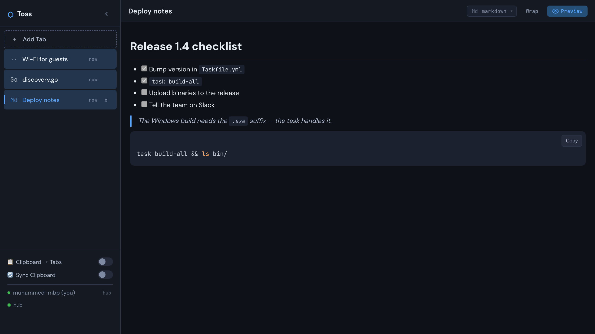
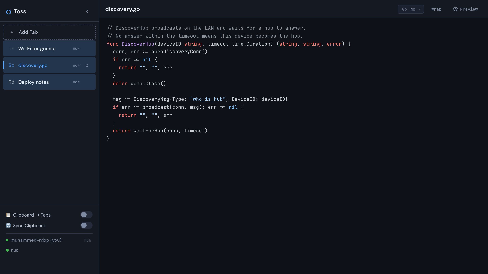

# Toss

**Share text, code, images and files between the devices on your local network. Zero
configuration: start it, open the page, everything you paste is on every screen.**

[](LICENSE)

[Website](https://mmdemirbas.github.io/toss/) ·
[Source](https://github.com/mmdemirbas/toss) ·
[Project page](https://mdemirbas.com/en/projects/toss/)



The thing you want on the other machine is a snippet, a screenshot, a config file, a Wi-Fi
password. Mailing it to yourself is slow; a chat app puts it on someone's server. Toss is one
binary that runs on each device: the first one up becomes the hub, the others find it by
broadcast, and every pane — text, code with highlighting, markdown with preview, images, files
— is on all of them within the second.

- **Nothing to set up** — no accounts, no IP addresses, no config file; devices find each other
  over UDP broadcast
- **One binary, all assets inside** — Go only; the frontend is embedded and vendored, no npm, no
  network at build time
- **Works through one-way firewalls** — spokes connect outbound; a device that cannot be dialled
  asks the hub to dial it
- **Everything is a pane** — paste an image, drop a file, type a note; panes auto-title
  themselves and survive restarts
- **Clipboard, optionally** — turn on *Clipboard → Tabs* to make a pane of every copy, *Sync
  Clipboard* to share the clipboard itself

## Quick start

```bash
git clone https://github.com/mmdemirbas/toss.git && cd toss
task                       # or: go run ./cmd/toss
```

Open `https://localhost:7753`, accept the self-signed certificate once, and do the same on the
next device. Go 1.22+ is the only requirement, plus a LAN where UDP broadcast works (most home
and office networks).

## How it works


1. A device starts, broadcasts on UDP `:7754` and waits three seconds. Silence means it is the
   hub: it serves the UI on `:7753` and relays every change.
2. Every later device hears the hub's answer and connects to it over a TLS WebSocket. The
   connection is outbound, so firewalls that block incoming ports do not matter.
3. A spoke the hub cannot reach asks the hub to dial it back instead.
4. If the hub disappears, a spoke that cannot find one promotes itself; when two hubs meet, the
   lower device id keeps the role.

Panes, files and clipboard changes travel hub ↔ spoke and are stored on every device under
`~/.toss/`, so a restart shows the same panes.



## Using it

| Do | How |
|---|---|
| New pane | **Add Tab**, or paste an image / drop a file anywhere |
| Code with highlighting | Pick the language in the pane header, or let auto-detection choose |
| Markdown | Choose *markdown* and toggle **Preview**; every code block gets a copy button |
| Files on a phone | The file chooser on the empty pane |
| Reorder, rename, delete | Drag tabs; click the title; the `×` asks once |
| Word wrap | `Alt + W` in the editor and the preview |
| Leave preview | `Escape` |
| Hide the sidebar | The chevron beside the name; the state is remembered |

`./bin/toss -port 8080` changes the port (default `7753`).

## Build

```bash
task                # run the development server
task build          # binary for this platform → bin/
task build-all      # macOS, Windows, Linux → bin/
task test           # tests
task vendor         # re-download the vendored JS/CSS (only to bump versions)
```

Plain Go works too: `go run ./cmd/toss`, `go build -o bin/toss ./cmd/toss`, `go test ./cmd/toss`.

```
cmd/toss/          Go source (package main)
  web/             Frontend (HTML/JS/CSS), embedded into the binary
    vendor/        Vendored JS/CSS/fonts, checked in
Taskfile.yml       Build commands
```

## What is on disk

Under `~/.toss/`: `config.json` (device id and name), `panes.json` (every pane), `files/`
(uploads) and `certs/` (the self-signed TLS certificate and key, generated on first run).

## Security

Toss is for **trusted local networks** and is not meant to face the internet.

- No authentication: any device on the LAN can read and write panes. That is the point of
  zero-friction sharing, and the reason for the line above.
- WebSocket origin checks are off and the SSE endpoint answers CORS `*`, so any local browser
  can connect.
- All traffic is HTTPS and WSS with a self-signed certificate — no mixed-content warnings, but
  no CA-trusted encryption either.
- Markdown is sanitised with DOMPurify before rendering.

## Contributing

See [CONTRIBUTING.md](CONTRIBUTING.md).

## License

[MIT](LICENSE)
