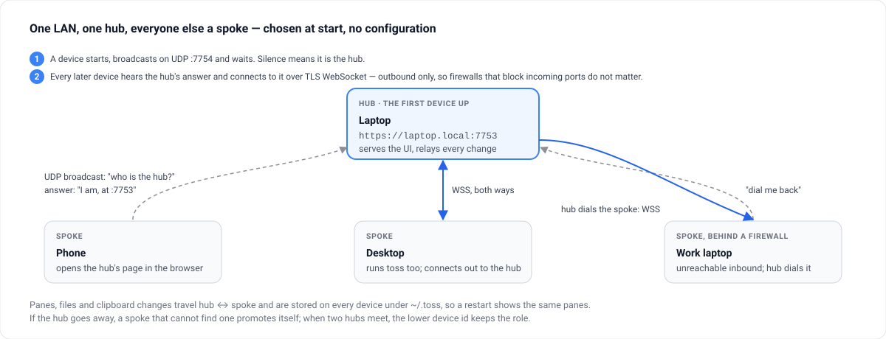

> [!TLDR]
> The first device to start is the hub; every later one broadcasts, hears the hub's answer, and connects outbound over WSS. A spoke the hub cannot reach asks to be dialled back. Lose the hub and a spoke promotes itself.

## Topology {#topology}



```oku-step-flow
{"steps":[{"t":"Start","b":"A device broadcasts \"who is the hub?\" on UDP `:7754` and waits three seconds. Silence means it is the hub: it serves the UI on `:7753` and relays every change."},{"t":"Join","b":"Every later device hears the hub's answer and connects to it over a TLS WebSocket. The connection is outbound, so firewalls that block incoming ports do not matter."},{"t":"Reverse dial","b":"A spoke the hub cannot reach directly asks the hub to dial it back; the sync channel is the same afterwards."},{"t":"Lose the hub","b":"A spoke that cannot find a hub after its backoff promotes itself. When two hubs meet, the one with the lower device id keeps the role and the other demotes to spoke."}]}
```

## What travels {#travels}

```oku-table
{"headers":["Change","Path","Stored"],"rows":[["A pane edit","spoke → hub → every other spoke, over WSS","`~/.toss/panes.json` on each device"],["An image or file","uploaded to the hub over HTTPS, announced over WSS","`~/.toss/files/` on each device"],["The clipboard","polled locally; a pane per copy (*Clipboard → Tabs*) or pushed to peers (*Sync Clipboard*)","as panes, or not at all"],["The browser page","served by the hub; live updates over SSE","—"]]}
```

## On disk {#disk}

```oku-table
{"headers":["File","Holds"],"rows":[["`~/.toss/config.json`","Device id and name"],["`~/.toss/panes.json`","Every pane"],["`~/.toss/files/`","Uploaded images and files"],["`~/.toss/certs/`","The self-signed TLS certificate and key, generated on first run"]]}
```
